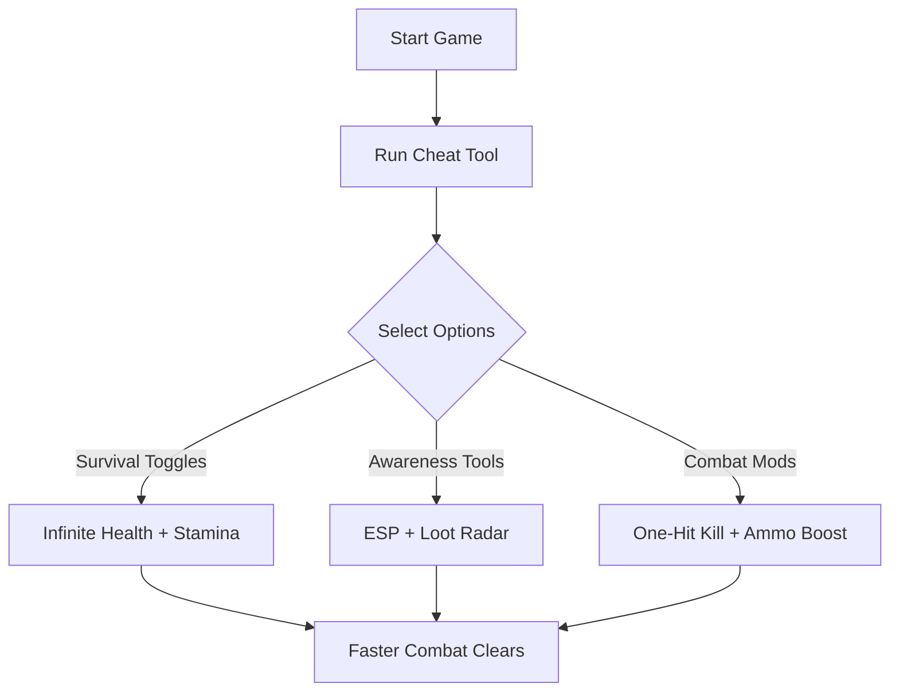

# Dying Light: The Beast Cheat 🧟‍♂️

The **Dying Light: The Beast Cheat Tool** is designed for survivors who want to push the limits of Harran’s brutal streets. Whether you’re focusing on hardcore parkour, nighttime survival, or farming rare loot, this cheat tool gives you customizable options to bend the rules of the apocalypse.

From infinite stamina to ESP-style awareness, it transforms the game into a sandbox where you’re always one step ahead of the infected.

---

## 📖 Overview

Dying Light: The Beast introduces new threats, deadlier enemies, and larger zones to explore. But grinding for resources and managing survival stats can slow down the action. This cheat tool ensures smooth progression by granting quick toggles for **combat, mobility, and awareness**—so you stay in control no matter the scenario.

[!WARNING]
This tool is intended for **single-player/offline use** only. Online play may result in bans or unfair lobbies.

---

## 🛠 Features

* **Infinite Stamina** – Chain parkour moves without tiring.
* **Unlimited Health** – Survive the harshest encounters.
* **Ammo & Crafting Max** – Never run out of bullets or supplies.
* **ESP Overlay 👁** – See enemies, survivors, and loot through walls.
* **One-Hit Kills** – Clear hordes instantly.
* **Speed Multiplier** – Parkour faster and escape more easily.
* **Loot Radar** – Highlights valuable resources and rare drops.
* **Hotkey Customization** – Assign toggles to F1–F12.

---

## 💻 Compatibility

| Platform       | Status         | Notes                          |
| -------------- | -------------- | ------------------------------ |
| Windows 10/11  | ✅ Full Support | Steam & Epic builds supported  |
| Steam Deck     | ⚠️ Partial     | Requires Proton overlay tweaks |
| Linux (Proton) | ⚠️ Partial     | Some ESP elements may glitch   |
| Consoles       | ❌ Unsupported  | PC-only cheat tool             |

[!NOTE]
The overlay is optimized for **DirectX 12 mode**—ensure your game uses this renderer.

---

## ⚡ Setup Guide

1. **Download and extract** the cheat package.
2. Start *Dying Light: The Beast*.
3. Run `DLBeast_Cheat.exe` as Administrator.
4. Press `Insert` to open the in-game overlay.
5. Toggle features with hotkeys or via the GUI menu.

```ini
[CheatConfig]
InfiniteStamina=F1
InfiniteHealth=F2
AmmoMax=F3
ESP=F4
SpeedBoost=F5
```

---

## 📊 Cheat Flow Diagram



---

## ❓ FAQ

**Q: Can this be used online?**
A: No, it’s strictly recommended for offline play.

**Q: Does ESP show both zombies and human NPCs?**
A: Yes, the overlay distinguishes them with different colors.

**Q: Will updates break compatibility?**
A: The tool is patched regularly alongside Beast updates.

**Q: Is there controller support?**
A: The overlay is keyboard-based, but hotkeys can be mapped to controller macros.

**Q: Can I edit speed and stamina multipliers?**
A: Yes, values are fully adjustable in the config file.

---

## 🎯 Final Thoughts

The **Dying Light: The Beast Cheat Tool** is built for players who want to dominate the undead apocalypse with **awareness, mobility, and resilience**. It removes grinding barriers while letting you explore, fight, and survive on your own terms.

---
